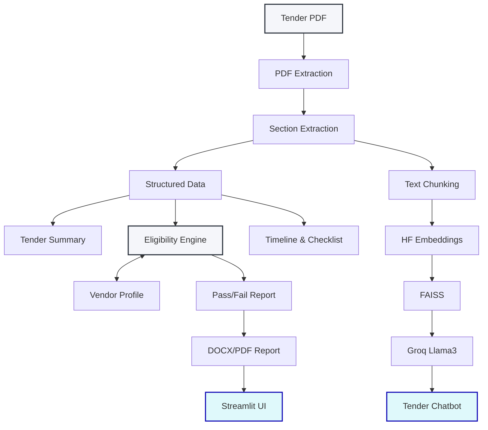

# 📋 TenderSimplifier and Bid Eligibility Checker

A modular, high-performance Streamlit application designed to simplify dense public/private procurement tenders (e.g., CPPP, GeM, Karnataka e-Procurement) and dynamically evaluate a vendor's bid eligibility.

---

## 🌟 Key Features

1. **📄 Layout-Aware PDF Parser**: Extracts text robustly using a layered approach (`pdfplumber` + `PyPDF2` fallbacks) to retain complex tables and column structures.
2. **⚖️ Hybrid Eligibility Engine**: 
   * **Dual-Pass Design**: Uses Llama 3.3 (via Groq) to parse and structure tender criteria parameters (Turnover, Experience, Certifications, and MSME exceptions) into standard JSON format.
   * **Deterministic Python Rule Engine**: Evaluates the vendor's profile against the parsed criteria using pure Python logic, eliminating LLM hallucinations in pass/fail verdicts.
3. **📅 Checklist & Timeline Tracker**: Extracts crucial deadlines, milestones, and required submission documents into interactive tracking dashboards.
4. **💬 Interactive RAG Copilot**: Embeds the tender PDF text into an in-memory `FAISS` vector database using local `sentence-transformers/all-MiniLM-L6-v2` embeddings, providing a low-latency, zero-cost Q&A chatbot via Groq.
5. **🖨️ Professional Export**: Generates and downloads detailed compliance reports and checklists as formatted Microsoft Word (`.docx`) documents.

---

## 🏗️ System Architecture



---

## 🛠️ Technology Stack

* **Frontend**: Streamlit
* **PDF Engine**: pdfplumber & PyPDF2
* **LLM Orchestration**: LangChain & LangChain-Groq
* **LLM Engine**: Groq (Llama-3.3-70b-versatile)
* **Vector DB & Embeddings**: FAISS & Sentence-Transformers (`all-MiniLM-L6-v2`)
* **Document Export**: python-docx

---

## 📂 Project Structure

```text
tender-simplifier/
├── app.py                  # Main Streamlit dashboard UI and layout logic
├── pdf_processing.py       # Layout-aware PDF text extraction functions
├── section_extractor.py    # Regex slicing and formatting for Summaries/Timelines
├── eligibility_engine.py   # LLM parameter extraction & Python deterministic evaluator
├── rag_engine.py           # In-memory FAISS indexing and RAG chatbot engine
├── doc_generator.py        # Compiles executive summaries and checkers to MS Word (.docx)
├── prompts.py              # Centralized prompts and system instructions
├── requirements.txt        # Package dependencies list
├── .env.example            # Template for environment configuration
└── README.md               # Documentation
```

---

## 🚀 Getting Started

### 1. Prerequisites
* Python 3.10 or 3.11 recommended.
* Git.

### 2. Installation
Clone the repository and install the dependencies:
```bash
git clone https://github.com/SwatejaP/TenderSimplifier_and_BidEligibilityChecker.git
cd TenderSimplifier_and_BidEligibilityChecker
pip install -r requirements.txt
```

*Note: The app uses HuggingFace embeddings which run locally. The first time you load a tender, it will download the model weights (approx. 90MB) automatically.*

### 3. Configure API Keys
1. Copy the example environment file:
   ```bash
   cp .env.example .env
   ```
2. Open `.env` and add your Groq API key:
   ```env
   GROQ_API_KEY=gsk_your_actual_groq_api_key_here
   ```

*Note: The `.env` file is excluded via `.gitignore` to keep your API key secure.*

### 4. Running the Application
Launch the Streamlit dashboard:
```bash
streamlit run app.py
```
Open your browser and navigate to `http://localhost:8501`.

---

## 📑 How to Test / Validate
1. Set up your **Vendor Profile** in the left sidebar (Average Annual Turnover, Years of Experience, Certifications, and MSME status).
2. Upload a tender PDF document (e.g., standard CPPP or GeM tender document).
3. The dashboard will automatically parse and display:
   * **Executive Summary**: A concise breakdown of the scope of work.
   * **Eligibility Report**: Color-coded Pass/Fail breakdown based on your vendor profile against the tender requirements.
   * **Checklist & Timeline**: Required documents, deadlines, and milestones.
   * **Interactive Copilot**: Ask arbitrary questions about the tender (e.g., *"What is the Earnest Money Deposit (EMD) requirement?"*).
4. Click **"Download Compliance Report"** to export your checklist and summary to a Word document.
